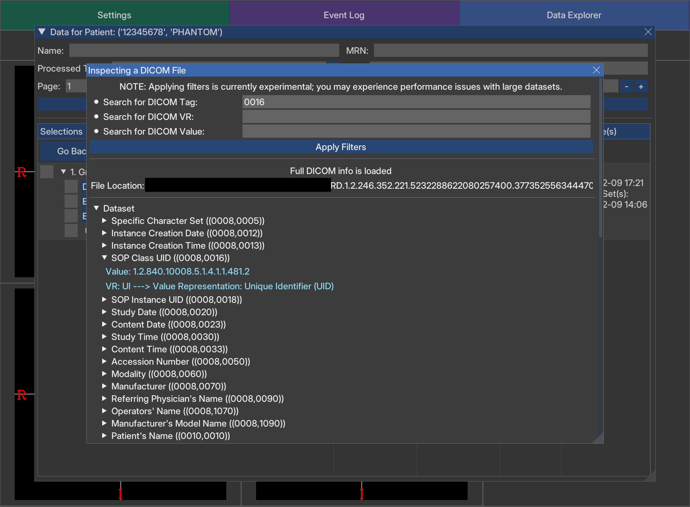

<p align="center">
  
</p>

<h1 align="center">MedicalDataHandler</h1>  
<p align="center"><em>A Research-Oriented Graphical User Interface for DICOM Processing, Image Analysis, and Data Management</em></p>
<p align="center"><em><a href="https://github.com/AustenMan/MedicalDataHandler/releases"><strong>🔗 Only looking for the latest EXE? Click here!</strong></a></em></p>

---

**Contributors:**  
Austen Maniscalco, Yang Park, Andrew Godley, Mu-Han Lin, Steve Jiang, and Dan Nguyen  

**Affiliation:**  
Medical Artificial Intelligence and Automation Laboratory, Department of Radiation Oncology, University of Texas Southwestern Medical Center, Dallas, TX, 75390, USA  

**Contact:**  
Austen Maniscalco ([Austen.Maniscalco@UTSouthwestern.edu](mailto:Austen.Maniscalco@UTSouthwestern.edu))  

---

## 📌 Overview  

### **What is MedicalDataHandler?**  
MedicalDataHandler is a **graphical user interface (GUI) tool** built with [Dear PyGUI](https://github.com/hoffstadt/DearPyGui) for **DICOM data processing, validation, and transformation**. It enables users to:  
- **Manage DICOM data effortlessly** without coding.  
- **Automatically detect and organize DICOM files** into structured datasets.  
- **Inspect and visualize patient data** with **real-time rendering**.  
- **Export data in NIfTI format** for seamless integration in downstream pipelines (e.g., AI model training).  

---

<p align="center">
  
  <br>
  <em>Figure 1: A brief animation to demonstrate basic functionality in MedicalDataHandler.</em>
</p>

---

### **Why was this created?**  
- ✅ **Standardize DICOM data processing** for **researchers, students, and trainees** without requiring programming skills.  
- ✅ **Offer an intuitive, modern GUI** for **flexible, codeless** data visualization and processing.  
- ✅ **Minimize opportunity for user error** with features such as:  
   - **Automated DICOM file identification and organization**, eliminating manual organization of DICOM files across numerous folders.  
   - **Structured tables** displaying data by **patient** and **Frame of Reference** for improved clarity.  
   - **Automated Structure Name Matching & Renaming** following [TG-263](https://www.aapm.org/pubs/reports/RPT_263.pdf).  
- ✅ **Provide research-focused validation tools** to analyze DICOM metadata and catch errors before they propagate in downstream applications.  
- ✅ **Enable specialized post-processing**, including:  
   - **CT HU-to-RED conversion** (Hounsfield Units → Relative Electron Density)  
     - **Sample values are provided for convenience**, however, it is **STRONGLY ADVISED** to **update** these values in the configuration files to **align with your institutional data** 
       - **ct_HU_map_vals.json** and **ct_RED_map_vals.json** in the **config_files folder**
   - **Region-specific RED overrides** for segmented structures.  
   - **Dose Summation** across multiple dose distributions.  

---

## 🚀 Installation  

### **Option 1: Download Prebuilt EXE (Recommended)**  
> **[🔗 Download the latest release](https://github.com/AustenMan/MedicalDataHandler/releases)**  

### **Option 2: Run from Source**  

#### **Prerequisites**  
- **Python 3.11+**  
- Install dependencies:  
  ```sh
  pip install -r requirements.txt

### **System Requirements**  
- **Recommended specs:**  
   - **OS:** Windows
   - **CPU:** Any modern multi-core processor (tested with i7-12700)  
   - **RAM:** 32+ GB (tested with 32 GB)  
   - **GPU:** Optional (GUI is GPU-accelerated via [Dear PyGUI](https://github.com/hoffstadt/DearPyGui))  

---

## 📂 Features  

### **📊 DICOM Data Management & Processing**  
- ✔ **Automated DICOM file identification** in a user-specified directory.  

  <p align="center">
    
    <br>
    <em>Figure 2: Users can select "Add New Data", and then "Choose a DICOM Directory" to specify a folder for searching DICOM files.</em>
  </p>

- ✔ **Automated DICOM file linking** to group related data.  

  <p align="center">
    
    <br>
    <em>Figure 3: After the search completes, users can select "Start Linking DICOM Files" to automatically read, organize, and group related files.</em>
  </p>

- ✔ **Patient Data Table** for structured display of accessible patient data.  

  <p align="center">
    
    <br>
    <em>Figure 4: Selecting "Explore Data" followed by "Load or Reload Data Table" creates patient rows, with timestamps for creation, modification, access, and processing.</em>
  </p>

- ✔ **Patient Object Inspection** for in-depth data analysis.  

  <p align="center">
    
    <br>
    <em>Figure 5: Clicking "Inspect" in the patient table allows detailed examination of the patient object, including nested data and data relationships.</em>
  </p>

- ✔ **DICOM metadata inspection** with collapsible trees and filters.

  <p align="center">
    
    <br>
    <em>Figure 6: The DICOM metadata inspection panel enables structured viewing and filtering of attributes for individual files.</em>
  </p>

- ✔ **Frame Of Reference UID Data Table** for deeper organization of patient-specific data.  

  <p align="center">
    
    <br>
    <em>Figure 7: Selecting a patient updates the table to show available Frame of Reference UIDs and associated modalities for better data organization.</em>
  </p>

### **🖼️ Interactive 2D Visualization**  
- ✅ **Data visualization** by converting DICOM data to [SimpleITK](https://github.com/SimpleITK/SimpleITK) Images and [NumPy](https://github.com/numpy/numpy) arrays.  

  <p align="center">
    
    <br>
    <em>Figure 8: After selecting a Frame of Reference UID, users pick the data to load and press "Load Selected Data" to visualize it.</em>
  </p>

- ✅ **Customizable display toggles** for flexible visualization of any loaded images, dose distributions, and/or structures.  

  <p align="center">
    
    <br>
    <em>Figure 9: A fully loaded dataset displayed with interactive visualization controls and toggle options for images, dose distributions, and structures.</em>
  </p>

- ✅ **Three-pane view support** for axial, sagittal and coronal planes with the ability to:  
  - **Zoom**: `CTRL + Mouse Scroll`  
  - **Pan**: `Middle Mouse Drag`  
  - **Scroll through slices**: `Mouse Scroll`  
  - **Move Crosshairs (Synchronizes all viewing planes)**: `Right Mouse Click`  
  - **Inspect Voxels**: `Right Mouse Click` on a view to display a hovered voxel's:  
    - **Image values**  
    - **Dose values**  
    - **Segmentations present**  
  - **Move viewing planes** to **center of any ROI**.  
  - **Rename, recolor, or remove** segmentations.  

  <p align="center">
    
    <br>
    <em>Figure 1: Three-pane visualization of axial, sagittal, and coronal views, with voxel inspection at the cursor.</em>
  </p>

- ✅ **Inspection of loaded data** to add or edit certain fields, such as machine name.

  <p align="center">
    
    <br>
    <em>Figure 10: The inspection panel for loaded data allows adding or modifying specific fields, such as machine name or structure labels.</em>
  </p>

### **🔄 DICOM-to-NIfTI Conversion**  
- ✔ **NIfTI export** for each 3D volume while retaining DICOM metadata, and optionally retaining custom modifications.  
- ✔ **Customizable post-processing tools** and flexible **file naming** options.  
- ✔ **Supports both partial (single-item) and batch data saving**.  

  <p align="center">
    
    <br>
    <em>Figure 11: The save window enables exporting selected data to NIfTI format with customizable options.</em>
  </p>

### **🛠 Additional Features**  
- ✔ **Integrated logging window** for debugging.  
- ✔ **Take screenshots** by pressing Ctrl+S or the Print Screen key. Saves to a screenshot folder.  
- ✔ **Optimized performance** with **multiprocessing and multithreading** and a **GPU-accelerated GUI**.  
- ✔ **Settings window** with options such as:  
  - **GUI resizing**  
  - **Crosshair & orientation label adjustments**  
  - **Data rotation or flips**  

  <p align="center">
    
    <br>
    <em>Figure 12: The settings panel provides controls for GUI customization, data rotation/flips, etc.</em>
  </p>

---

## 🔄 Future Development  

### **🛠 Planned Features**  
- ✔ **Direct DICOM import from DAEMON Server**.  
- ✔ **Dose-Volume Histogram (DVH) visualization**.  
- ✔ **Basic image processing tools (e.g., applying filters).**  
- ✔ **3D RTPLAN beam data representation and beam visualization.**  
- ✔ **Direct NIfTI imports** and **writing back to DICOM format**.  
- ✔ **Potential C# re-write** for possible integration with **ESAPI**.  

---

## ⚠️ Disclaimers  

I am relatively new to computer science and software development; I learned as I built this software, and I aim to eventually re-write/re-factor much of the code.

A large language model (LLM) was used to assist with **code review, writing docstrings, and formatting this README**.  

---

### **🔗 Contributing**  
Interested in contributing? **Fork the repository**, make changes, and submit a pull request.  

---

## 📜 Licensing  

This software is licensed under a custom academic license from The University of Texas Southwestern Medical Center. It is available exclusively for academic research use under specific conditions. See [`LICENSE.txt`](LICENSE.txt) for details.  
Additionally, see the **`notices`** folder for third-party open-source software acknowledgments.  

---

## 📢 Acknowledgments  

**This work was supported by:**  
- **NIH grants R01CA237269, R01CA254377, and R01CA258987.**  
